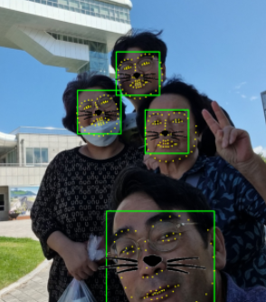
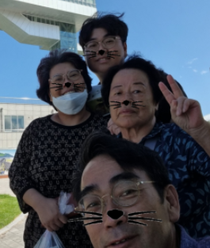
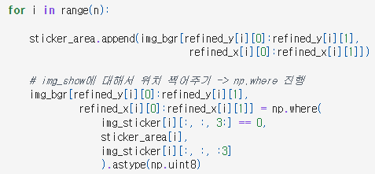
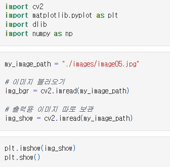
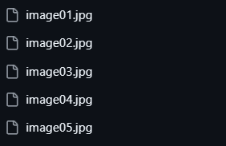
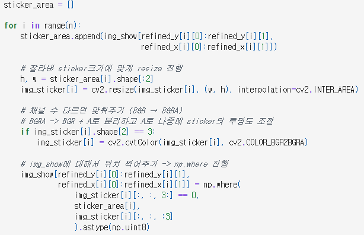

# AIFFEL Campus Online Code Peer Review Templete
- 코더 : 이수호
- 리뷰어 : 이상진


# PRT(Peer Review Template)
- [V]  **1. 주어진 문제를 해결하는 완성된 코드가 제출되었나요?**
    - 문제에서 요구하는 최종 결과물이 첨부되었는지 확인
        - 중요! 해당 조건을 만족하는 부분을 캡쳐해 근거로 첨부
    
- [V]  **2. 전체 코드에서 가장 핵심적이거나 가장 복잡하고 이해하기 어려운 부분에 작성된 
주석 또는 doc string을 보고 해당 코드가 잘 이해되었나요?**
    
    
- [V]  **3. 에러가 난 부분을 디버깅하여 문제를 해결한 기록을 남겼거나
새로운 시도 또는 추가 실험을 수행해봤나요?**

    
    여러이미지(마스크,모자를 쓴 이미지, 여러사람이 있는 이미지, 기울어져 있는 이미지)로 실험을 수행하였음
- [V]  **4. 회고를 잘 작성했나요?**
    - 주어진 문제를 해결하는 완성된 코드 내지 프로젝트 결과물에 대해
    배운점과 아쉬운점, 느낀점 등이 기록되어 있는지 확인
    - 전체 코드 실행 플로우를 그래프로 그려서 이해를 돕고 있는지 확인
        - 중요! 잘 작성되었다고 생각되는 부분을 캡쳐해 근거로 첨부
        
- [V]  **5. 코드가 간결하고 효율적인가요?**
    


# 회고(참고 링크 및 코드 개선)
```
코드가 이전 실습을 기반으로 잘 작성되어 있고 다양한 실험을 하였음
```
