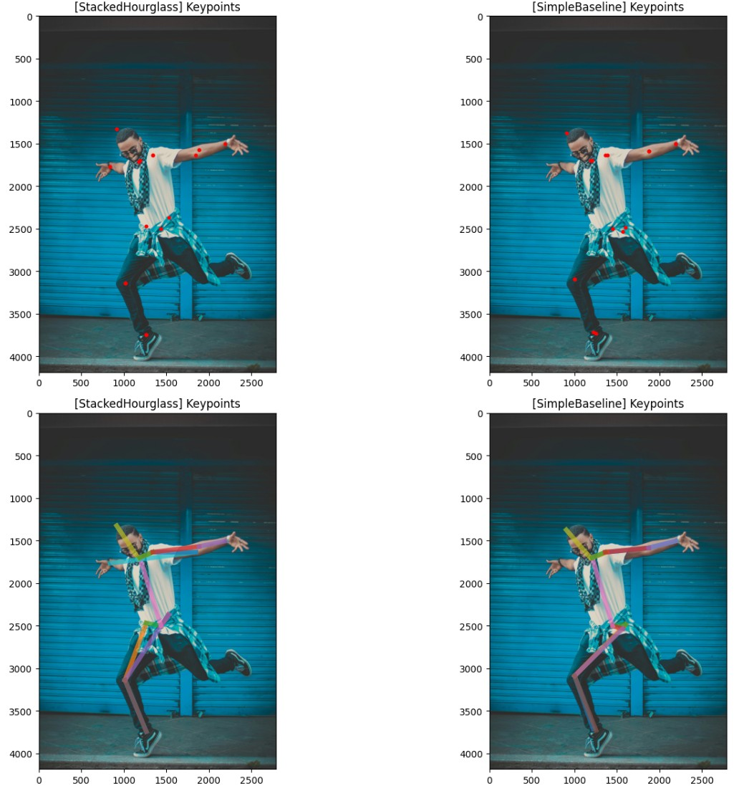
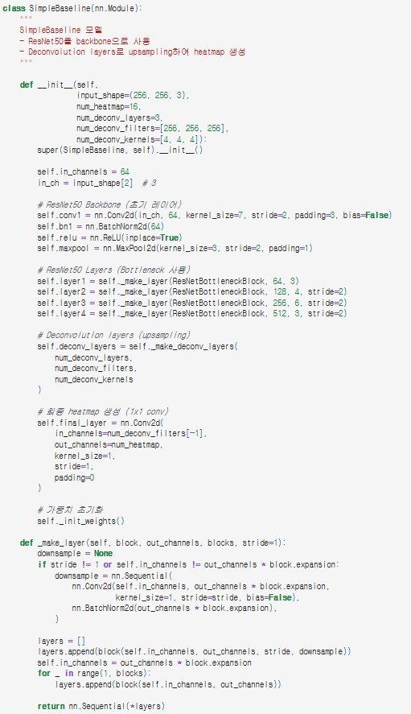
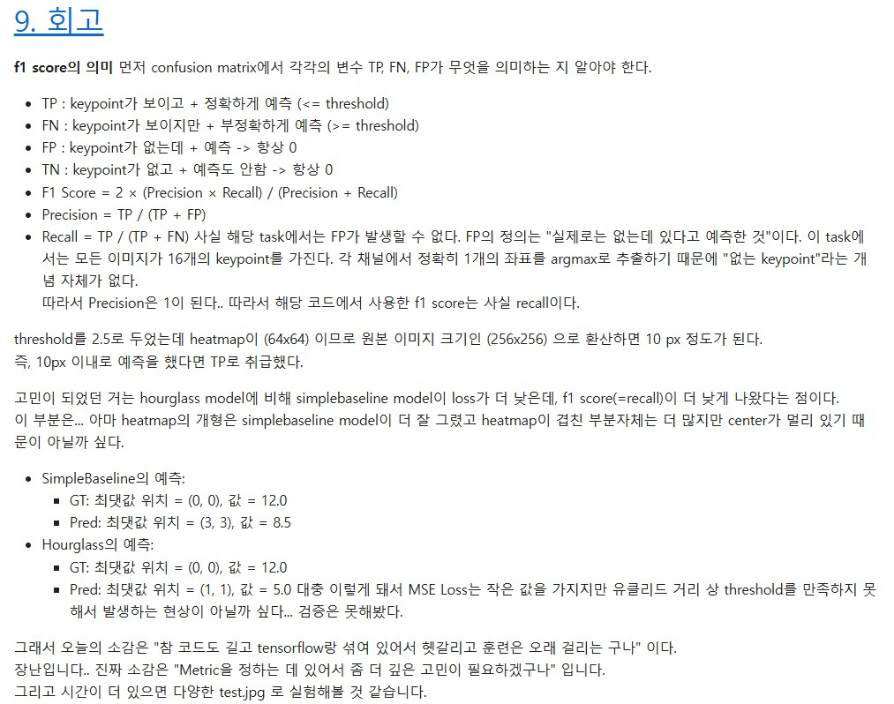

# AIFFEL Campus Online Code Peer Review Templete
- 코더 : 이수호
- 리뷰어 : 최재훈


# PRT(Peer Review Template)
- [x]  **1. 주어진 문제를 해결하는 완성된 코드가 제출되었나요?**
    - 기존 Hourglass 모델과 Simplebaseline 모델을 만들어 학습시키고 그 결과를 비교하는 코드가 포함되어있으며 두가지 모델의 성능을 비교하는 과정까지 잘 나와있습니다.  
    
    
- [x]  **2. 전체 코드에서 가장 핵심적이거나 가장 복잡하고 이해하기 어려운 부분에 작성된 주석 또는 doc string을 보고 해당 코드가 잘 이해되었나요?**
    - 가장 중요하다고 생각되는 부분은 Simplebaseline 모델을 구축한 부분이라고 생각합니다. 주석과 함께 잘 작성하였습니다.  
    
        
- [ ]  **3. 에러가 난 부분을 디버깅하여 문제를 해결한 기록을 남겼거나 새로운 시도 또는 추가 실험을 수행해봤나요?**  

        
- [x]  **4. 회고를 잘 작성했나요?**
    - F1 score의 의미를 설명하여 해당 성능의 평가 지표를 이해하기 쉽게 하였고 실험 결과에 따른 자신의 생각도 잘 포함하였습니다.  
    
        
- [x]  **5. 코드가 간결하고 효율적인가요?**
    - 전체적으로 코드를 구성할때 함수와 모듈화를 사용해서 중복되는 코드없이 간결하게 작성하였습니다.


# 회고(참고 링크 및 코드 개선)
```
제가 시도한 simplebaseline 모델은 학습이 잘되지 않았는데 수호님의 코드를 보니 잘 작동되는것같아 참고해서 다시 시도 해볼 수 있을 것 같습니다
제 코드에서는 제대로 확인하지 못한 Hourglass 모델과 Simplebaseline 모델의 성능 비교 및 시각화 부분을 확인할 수 있어서 좋았습니다.
```
